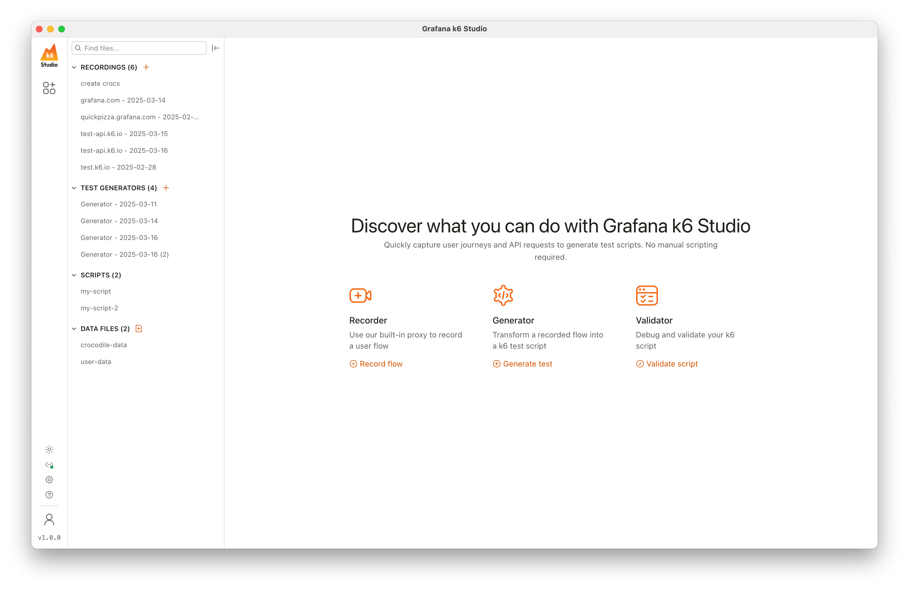

<p align="center">
  <a href="https://grafana.com/products/cloud/k6/">
    <picture>
      <source media="(prefers-color-scheme: dark)" srcset="assets/logo-dark-theme.svg">
      <source media="(prefers-color-scheme: light)" srcset="assets/logo.svg">
      
    </picture>
    <br>
    <picture>
      <source media="(prefers-color-scheme: dark)" srcset="assets/grafana-labs-dark-theme.svg">
      <source media="(prefers-color-scheme: light)" srcset="assets/grafana-labs.svg">
      
    </picture>
    <br>
  </a>
</p>

<p align="center">Desktop application for Mac, Windows and Linux designed to help you generate k6 test scripts</p>

<p align="center">
    <a href="https://github.com/grafana/k6-studio/releases">Download</a> ·
    <a href="https://grafana.com/docs/k6-studio/set-up/install/">Documentation</a> ·
    <a href="https://github.com/grafana/k6-studio/issues">Report issues</a>
</p>

<p align="center">
  
</p>

With **Grafana k6 Studio**, you can quickly record a user flow in a browser, generate and inspect a HAR recording, customize your test script using predefined or custom rules, and test and debug your script to ensure it's working as expected.

The goal is to provide **a seamless experience** for generating k6 test scripts, making it easier for anyone to create performance tests in an interactive interface.

---

## Demo

https://github.com/user-attachments/assets/e60dc872-56b3-4a7a-8f4b-23b12f9956b6

## Installation

Grafana k6 Studio is available for Mac, Windows and Linux. You can download the latest version from the [Releases page](https://github.com/grafana/k6-studio/releases).

> [!IMPORTANT]  
> [Google Chrome](https://www.google.com/chrome/browser-tools/) or [Chromium](https://www.chromium.org/Home/) need to be installed on your machine for the recording functionality to work.

## How it works

Grafana k6 Studio is composed of three main components:

### Recorder

The recorder is designed to generate a HAR recording of the user flow you want to test. When you start a recording, a new browser window opens, and every request is collected to generate the HAR file. You can also create groups during the recording to better organize your test script.

> The recorder uses a proxy to catch requests from the specific browser window, which is powered by [mitmproxy](https://github.com/mitmproxy/mitmproxy).

### Generator

The generator helps you create a k6 test script without having to write a single line of JavaScript.
You can choose a HAR recording to automatically generate a valid k6 script, and then apply rules to fine-tune your script. For example, you can use a correlation rule to extract and replace a variable across your script, or even add custom JavaScript after each request.

You can also configure test options, such as the load profile for your test, see a preview of the script after all the rules are applied, and validate or export the script.

### Validator

The validator can help you test a k6 script by executing a single VU and single iteration test run to make sure that your script is working as intended.
You can view the selected k6 script, all the requests and responses sent with the ability to inspect them in detail, the k6 logs, and also any k6 checks that are in your script.

## Support

If you have any issues with Grafana k6 Studio, would like to report a bug, or suggest new features, open a ticket [here](https://github.com/grafana/k6-studio/issues).

## License

Grafana k6 Studio is distributed under the [AGPL-3.0 license](https://github.com/grafana/k6-studio/blob/master/LICENSE).

---

## Troubleshooting

### `localhost` requests not being recorded

The proxy doesn't capture traffic when sent directly to `localhost`. To fix that, you can assign a hostname to it and make requests through that name.
To do that, modify the `hosts` file on your system, for example, `127.0.0.1 myapp`, and then you will be able to make requests in the browser at `myapp:8000/path`.

### "Proxy failed to start" error

If you're on a Mac, make sure you're not running the Grafana k6 Studio application from the Downloads folder. If that's the case, close the app, move the application file to the Applications folder, and start the app again.

### Application logs

Application logs are saved in the following directory:

- on Mac: `~/Library/Logs/k6 Studio/k6-studio.log`
- on Windows: `%USERPROFILE%\AppData\Roaming\k6 Studio\logs\k6-studio.log`
- on Linux: `~/.config/k6 Studio/logs/k6-studio.log`.

When opening an issue, please include a tail of your log file.

## Usage collection

By default, Grafana k6 Studio collects anonymous usage data to help us improve the product through data-driven decisions. This allows us to prioritize features that benefit users most and minimize the impact of changes.

For more information visit the [documentation](https://grafana.com/docs/k6-studio/set-up/usage-collection/).

---

## Contributing

If you're interested in contributing to the Grafana k6 Studio project:

- Start by reading the [Contributing guide](CONTRIBUTING.md)
- Explore our [issues](https://github.com/grafana/k6-studio/issues) and see if there's anything you'd like to work on
- Set up your development environment and start coding

## Development environment

### Dependencies

Make sure you have the following dependencies installed before setting up your developer environment:

- [Git](https://git-scm.com/downloads)
- [Node.js](https://nodejs.org/en/download/) ^v22.0.0

### Run Grafana k6 Studio locally

(Optional) If you're using nvm, switch to a compatible Node version:

```
nvm use
```

Before you can start the app, you need to install the related dependencies:

```
npm install
```

After the command has finished, you start the app locally with:

```
npm start
```
